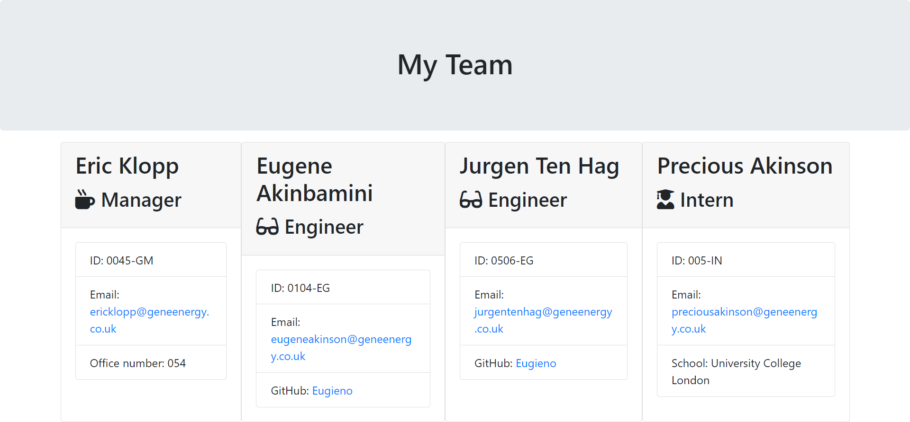

# My Team profile Maker
   
  
  
  ## Description
  My Team profile maker is an app that generates an HTML profile summary of selected professionals in a team, based on information supplied about them by the app user, built with node.js, inquirer package, jest, JS, and html. 
  
  ## Table of Contents
  * [Description](#description)
  * [Table of Contents](#table-of-contents)
  * [Installation](#installation)
  * [Usage](#usage)
  * [License](#license)
  * [Contributing](#contributing)
  * [Tests](#tests)
  * [Questions](#questions)
  * [Reflection](#reflection)
  * [Upcoming (New) Features](#upcoming-new-features)
  
  
  ## Installation
  Make sure you have node installed on your local machine. [Follow this link](https://coding-boot-camp.github.io/full-stack/nodejs/how-to-install-nodejs) to install node unto your local machine. 
  
  ## Usage
  * Clone the repo containing the application files unto your local machine or download the folder
  *  In your terminal, navigate to the location where the folder is stored on your local machine
  * Run the command ```node index.js``` in the command line.
  * Answer the questions following
  * At the end, an html file that details the profile summary of each team member will be created.

  A demo of the app can be found below;
  In this demo, the profiles of a team consisting of a Manager, 2 Engineers and an Intern is being generated.
  

  Below is a snapshot of the generated HTML file rendered in the browser.
  
  
  
  ## License
  Copyright &copy; 2023 Oluyemi Eugene Akinbamini       
  This project is [MIT](/LICENSE) licensed
  
  ## Contributing
  * Fork the repository and create your branch from main. 
  * If you've added code that should be tested, add tests.
  * If you've changed APIs, update the documentation.
  * Ensure the test suite passes.
  * Make sure your code lints.
  * Issue that pull request!
  * Always add a README and/or requirements.txt to your added code.
  
  ## Tests
  To test this app; 
  * Open the folder in your terminal
  * While at the root (folder), use the command  ```cd __tests__```  to navigate to the test folder.
  * While in the test folder, run the command ```npm run test``` 
  
  ## Questions
  Feel free to contact me for additional questions and I will get back to you  
  Email: [eugeneakinson@gmail.com ](#)       
  Github profile: [Eugieno](https://github.com/Eugieno)

## Reflection
This project was completed at the end of my 12th week at the University of Birmingham bootcamp in FE web dev. 
The main objective of this project was to convert a starter code into a working Node.js command line application that is testable, extensible, and maintainable. 

An interesting part of this challenge is that it has helped me appreciate the benefits of test-driven development. I enjoyed applying some SOLID design principles such as the Single Responsibility and Liskov substitution in developing classes and recognising others within the starter code provided. 

In summary, as a result of this project, I am now familiar with the fundamentals of TDD with node.js. Looking ahead, I will be building applications of this kinds/form from scratch. 

## Upcoming (New) Features
In the immediate future, I plan to include the following features to extend the functionality and UI/UX of this CLI app.
* More child classes to extend the template of possible professional profile that can be generated. Currently, only 3 exist, The Manager, Engineer and Intern. 

